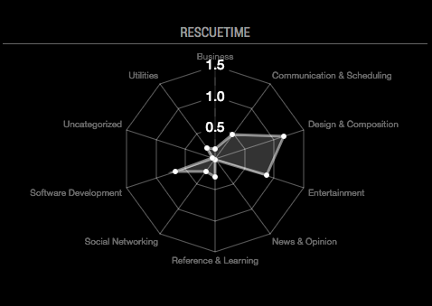

# MMM-RescueTime
This is a module for the [MagicMirror](https://github.com/MichMich/MagicMirror). It displays your time data you spent on activities from RescueTime logged today.

## Installation
1. Go to MagicMirror's `modules`.
2. Run `git clone https://github.com/Duske/MMM-RescueTime`. 
3. Go into the newly created directory with `cd MMM-RescueTime`.
4. Execute `npm install` to install the node dependencies.

## Screenshot



## Usage

To able to use this module, make sure you have an RescueTime account (*free account is fine*) and a API key. You can 
generate one here: https://www.rescuetime.com/anapi/manage

*Please note that only today's data will be shown.*

Then add this module to your `config/config.js` file:
````javascript
modules: [
	{
		module: 'MMM-RescueTime',
		position: 'top_right',	// Or any other region
		header: 'RescueTime', // An optional title
		config: {
			// See 'Configuration options' for more information.
		}
	}
]

## Configuration

The following properties can be configured:

| Option        | Description   | Default  |
| ------------- |:-------------:| -----:|
| apiKey                | Your RescueTime API key                                   | **None, this has to be set by you**|
| interval              | Interval in seconds how often the data should be fetched  | 60 |
| pointBackgroundColor  | Background color of the dots                              | "#fff" |
| borderColor           | Color of the border surrounding your data                 | "rgba(255,255,255,0.5)" |
| backgroundColor       | Background color of the plane  surrounding your data      | "rgba(255,255,255,0.2)" |
| angleLinesColor       | Color of the angle lines                                  | "rgba(255,255,255,0.2)" |
| gridLinesColor        | Color of the grid lines                                   | "rgba(255,255,255,0.2)" |
